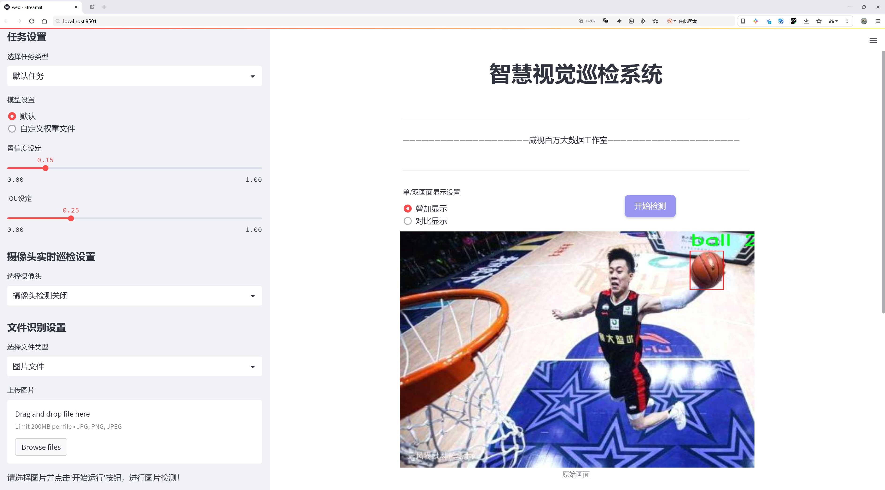
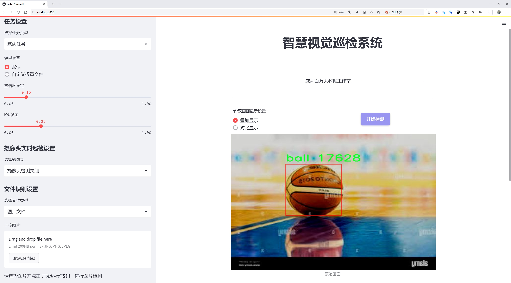
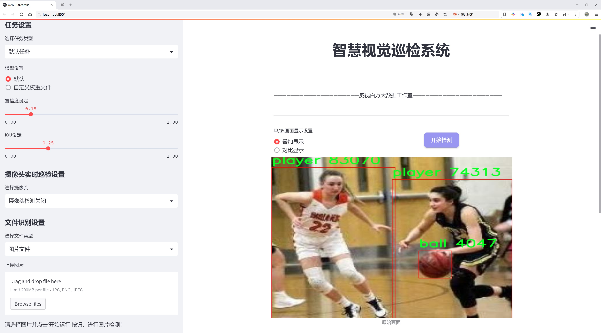
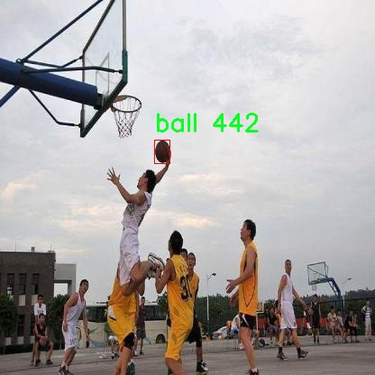
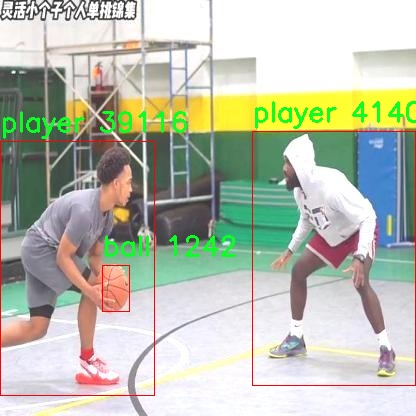
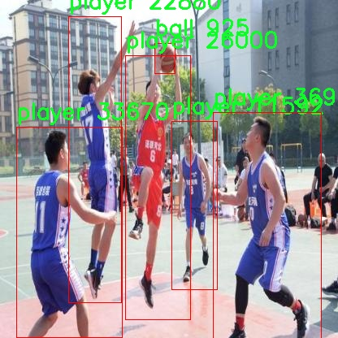
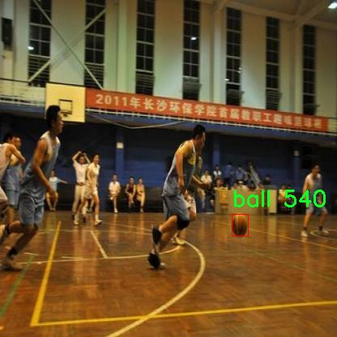

# 篮球运动场景物体检测检测系统源码分享
 # [一条龙教学YOLOV8标注好的数据集一键训练_70+全套改进创新点发刊_Web前端展示]

### 1.研究背景与意义

项目参考[AAAI Association for the Advancement of Artificial Intelligence](https://gitee.com/qunmasj/projects)

项目来源[AACV Association for the Advancement of Computer Vision](https://kdocs.cn/l/cszuIiCKVNis)

研究背景与意义

随着人工智能技术的迅猛发展，计算机视觉在各个领域的应用越来越广泛，尤其是在体育领域。篮球作为全球范围内广受欢迎的运动，其比赛场景中涉及到的动态物体检测问题引起了学术界和工业界的广泛关注。传统的篮球比赛分析主要依赖于人工观察和记录，这不仅耗时耗力，而且容易受到主观因素的影响。基于深度学习的物体检测技术，尤其是YOLO（You Only Look Once）系列模型的提出，为实时、准确地分析篮球比赛提供了新的可能性。

YOLOv8作为YOLO系列的最新版本，具备了更高的检测精度和更快的处理速度，适合于复杂的运动场景。通过改进YOLOv8模型，能够有效提升在篮球运动场景中对球员和篮球的检测能力。具体而言，改进后的YOLOv8模型可以在复杂的背景、快速的运动状态下，实时识别和定位篮球场上的球员和篮球，从而为比赛分析、战术研究和运动员训练提供数据支持。

本研究所使用的数据集“nexsports-ball”包含了10000张篮球运动场景的图像，涵盖了两个主要类别：篮球和球员。这一数据集的构建为训练和评估改进YOLOv8模型提供了丰富的样本基础。通过对该数据集的深入分析，可以提取出篮球运动场景中的关键特征，进而优化模型的参数设置和结构设计，以提高检测的准确性和鲁棒性。

在篮球运动中，球员的动作、位置以及篮球的运动轨迹都是影响比赛结果的重要因素。通过高效的物体检测系统，可以实现对比赛过程的实时监控与分析，为教练和运动员提供数据驱动的决策支持。例如，教练可以利用检测系统分析球员的跑位情况、投篮命中率等数据，从而制定更为科学的训练计划和战术安排。此外，观众也可以通过该系统获取比赛的实时数据分析，提升观赛体验。

从更广泛的角度来看，基于改进YOLOv8的篮球运动场景物体检测系统的研究，不仅能够推动篮球运动的智能化发展，还能够为其他运动项目的物体检测提供借鉴。随着数据集的不断丰富和模型的不断优化，该系统有望在未来实现更为广泛的应用，包括运动员表现评估、比赛策略分析以及智能裁判系统等。

综上所述，基于改进YOLOv8的篮球运动场景物体检测系统的研究，不仅具有重要的学术价值，还具备广泛的应用前景。通过对篮球运动场景的深入研究，我们能够推动体育数据分析的智能化进程，为篮球运动的科学发展贡献力量。

### 2.图片演示







##### 注意：由于此博客编辑较早，上面“2.图片演示”和“3.视频演示”展示的系统图片或者视频可能为老版本，新版本在老版本的基础上升级如下：（实际效果以升级的新版本为准）

  （1）适配了YOLOV8的“目标检测”模型和“实例分割”模型，通过加载相应的权重（.pt）文件即可自适应加载模型。

  （2）支持“图片识别”、“视频识别”、“摄像头实时识别”三种识别模式。

  （3）支持“图片识别”、“视频识别”、“摄像头实时识别”三种识别结果保存导出，解决手动导出（容易卡顿出现爆内存）存在的问题，识别完自动保存结果并导出到tempDir中。

  （4）支持Web前端系统中的标题、背景图等自定义修改，后面提供修改教程。

  另外本项目提供训练的数据集和训练教程,暂不提供权重文件（best.pt）,需要您按照教程进行训练后实现图片演示和Web前端界面演示的效果。

### 3.视频演示

[3.1 视频演示](https://www.bilibili.com/video/BV1bQtCeNE3J/)

### 4.数据集信息展示

##### 4.1 本项目数据集详细数据（类别数＆类别名）

nc: 2
names: ['ball', 'player']


##### 4.2 本项目数据集信息介绍

数据集信息展示

在本研究中，我们使用了名为“nexsports-ball”的数据集，以改进YOLOv8在篮球运动场景中的物体检测能力。该数据集专门针对篮球运动的特定需求而设计，包含了丰富的场景和多样化的物体，以便于模型在实际应用中能够更好地识别和定位篮球场上的关键元素。数据集的类别数量为2，具体包括“ball”（篮球）和“player”（球员），这两个类别是篮球比赛中最为重要的元素。

“nexsports-ball”数据集的构建过程考虑到了篮球比赛的复杂性和动态性。数据集中包含了多种不同的比赛场景，包括不同的场馆、不同的时间段以及不同的比赛状态。这种多样性确保了模型在训练过程中能够接触到丰富的视觉信息，从而提高其在实际应用中的泛化能力。此外，数据集中的图像不仅包括球员在场上的静态姿势，还涵盖了他们在比赛中快速移动、投篮、传球等动态行为的瞬间。这种动态数据的引入使得模型能够更好地理解和预测球员的行为，从而在物体检测任务中表现得更加出色。

为了确保数据集的高质量和准确性，所有图像均经过精心标注。每一张图像中的篮球和球员都被准确地框选出来，并附上相应的标签。这种精确的标注不仅提高了训练数据的可靠性，也为后续的模型评估提供了坚实的基础。在数据集的构建过程中，研究团队还特别关注了不同光照条件、视角和背景对物体检测的影响，确保模型能够在各种环境下保持良好的性能。

此外，数据集的规模也经过精心设计，以满足YOLOv8模型的训练需求。通过大量的图像样本，模型能够学习到丰富的特征表示，从而在检测任务中表现出更高的准确性和鲁棒性。研究团队还计划在未来的工作中，进一步扩展数据集的规模和多样性，加入更多的场景和物体，以提升模型的性能。

总之，“nexsports-ball”数据集为改进YOLOv8在篮球运动场景中的物体检测提供了坚实的基础。通过精确的标注、多样化的场景和丰富的动态信息，该数据集不仅增强了模型的学习能力，也为后续的研究和应用奠定了良好的基础。随着对该数据集的深入研究和应用，我们期待能够在篮球运动的物体检测领域取得更为显著的进展，为相关技术的发展贡献力量。










### 5.全套项目环境部署视频教程（零基础手把手教学）

[5.1 环境部署教程链接（零基础手把手教学）](https://www.ixigua.com/7404473917358506534?logTag=c807d0cbc21c0ef59de5)


[5.2 安装Python虚拟环境创建和依赖库安装视频教程链接（零基础手把手教学）](https://www.ixigua.com/7404474678003106304?logTag=1f1041108cd1f708b01a)

### 6.手把手YOLOV8训练视频教程（零基础小白有手就能学会）

[6.1 手把手YOLOV8训练视频教程（零基础小白有手就能学会）](https://www.ixigua.com/7404477157818401292?logTag=d31a2dfd1983c9668658)

### 7.70+种全套YOLOV8创新点代码加载调参视频教程（一键加载写好的改进模型的配置文件）

[7.1 70+种全套YOLOV8创新点代码加载调参视频教程（一键加载写好的改进模型的配置文件）](https://www.ixigua.com/7404478314661806627?logTag=29066f8288e3f4eea3a4)

### 8.70+种全套YOLOV8创新点原理讲解（非科班也可以轻松写刊发刊，V10版本正在科研待更新）

由于篇幅限制，每个创新点的具体原理讲解就不一一展开，具体见下列网址中的创新点对应子项目的技术原理博客网址【Blog】：


[8.1 70+种全套YOLOV8创新点原理讲解链接](https://gitee.com/qunmasj/good)

### 9.系统功能展示（检测对象为举例，实际内容以本项目数据集为准）

图9.1.系统支持检测结果表格显示

  图9.2.系统支持置信度和IOU阈值手动调节

  图9.3.系统支持自定义加载权重文件best.pt(需要你通过步骤5中训练获得)

  图9.4.系统支持摄像头实时识别

  图9.5.系统支持图片识别

  图9.6.系统支持视频识别

  图9.7.系统支持识别结果文件自动保存

  图9.8.系统支持Excel导出检测结果数据


### 10.原始YOLOV8算法原理

原始YOLOv8算法原理

YOLOv8作为YOLO系列的最新版本，承载着深度学习目标检测领域的诸多创新与改进。自2015年YOLO模型首次提出以来，YOLO系列经历了多个版本的迭代，每一次更新都在追求更快的推理速度和更高的检测精度。YOLOv8在此基础上，进一步优化了网络结构，使其在实际应用中表现出色，成为当前业界最受欢迎的目标检测算法之一。

YOLOv8的网络结构主要由三部分组成：Backbone（骨干网络）、Neck（颈部结构）和Head（头部结构）。其中，Backbone负责特征提取，Neck用于特征融合，而Head则负责最终的检测输出。这样的设计使得YOLOv8能够有效地处理复杂的目标检测任务，提供准确且高效的结果。

在Backbone部分，YOLOv8借鉴了YOLOv7中的ELAN模块，采用了C2F模块替代了YOLOv5中的C3模块。C2F模块通过引入更多的并行梯度流分支，增强了特征提取的能力。这种设计不仅提高了模型的精度，还有效降低了延迟，使得YOLOv8在处理高分辨率图像时依然能够保持良好的性能。C2F模块的结构设计旨在通过跨层连接，丰富梯度流的信息，从而形成更强的特征表示能力。这种改进使得YOLOv8在面对多样化的目标时，能够更好地捕捉到目标的特征。

在Neck部分，YOLOv8对特征融合的方式进行了优化，去除了YOLOv5中两次上采样之前的1x1卷积连接层，直接对Backbone不同阶段输出的特征进行上采样。这一变化不仅简化了网络结构，还提升了特征融合的效率，使得模型在不同尺度的目标检测中表现得更加出色。通过路径聚合网络（PAN）的引入，YOLOv8能够更好地处理不同尺度的对象，增强了网络对多尺度特征的融合能力。

YOLOv8的Head部分是其最大的创新之一，主要体现在将耦合头（Coupled-Head）转变为解耦头（Decoupled-Head）。在YOLOv5中，检测和分类共用一个卷积，而YOLOv8则将这两个任务分开处理。解耦头结构使得模型在进行类别预测和边界框回归时能够更加专注，从而提高了整体的检测精度。在损失函数的设计上，YOLOv8采用了BCELoss（Binary Cross Entropy Loss）用于分类分支，而边界框回归分支则结合了DFL（Distribution Focal Loss）和CIoULoss（Complete Intersection over Union Loss），旨在快速聚焦于标签附近的数值，提升模型对边界框的预测能力。

此外，YOLOv8摒弃了传统的Anchor-Based（基于锚框）方法，转而采用Anchor-Free（无锚框）策略。这一创新使得YOLOv8在目标检测时不再依赖于预设的锚框，从而减少了计算复杂度，提高了模型的灵活性。通过将目标检测转化为关键点检测，YOLOv8能够在不同的训练数据集上展现出更强的泛化能力，简化了网络框架。

在输入端，YOLOv8采用了自适应图片缩放技术，以提高目标检测和推理的速度。该技术通过将图像的长边按比例缩小到指定尺寸，并对短边进行填充，尽量减少信息冗余。同时，YOLOv8在训练过程中引入了Mosaic数据增强技术，通过随机拼接多张图像，增强了模型对不同位置和周围像素的学习能力。这种增强策略有效提高了模型的预测精度和性能。

总的来说，YOLOv8在多个方面的改进使其在目标检测任务中展现出卓越的性能。通过引入更为先进的网络结构、优化特征融合方式、解耦检测与分类任务，以及采用无锚框检测策略，YOLOv8不仅提高了检测精度和速度，还增强了模型的灵活性和适应性。这些创新使得YOLOv8成为了目标检测领域中的一款强大工具，广泛应用于各种实际场景中，推动了深度学习技术的进一步发展。


### 11.项目核心源码讲解（再也不用担心看不懂代码逻辑）

#### 11.1 code\ultralytics\models\yolo\segment\val.py

以下是对代码的核心部分进行的分析和详细注释：

```python
# 导入必要的库
from multiprocessing.pool import ThreadPool
from pathlib import Path
import numpy as np
import torch
import torch.nn.functional as F
from ultralytics.models.yolo.detect import DetectionValidator
from ultralytics.utils import LOGGER, NUM_THREADS, ops
from ultralytics.utils.checks import check_requirements
from ultralytics.utils.metrics import SegmentMetrics, box_iou, mask_iou
from ultralytics.utils.plotting import output_to_target, plot_images

class SegmentationValidator(DetectionValidator):
    """
    继承自DetectionValidator类，用于基于分割模型的验证。
    """

    def __init__(self, dataloader=None, save_dir=None, pbar=None, args=None, _callbacks=None):
        """初始化SegmentationValidator，设置任务为'segment'，并初始化指标为SegmentMetrics。"""
        super().__init__(dataloader, save_dir, pbar, args, _callbacks)
        self.plot_masks = None  # 用于存储绘制的掩码
        self.process = None  # 处理掩码的函数
        self.args.task = "segment"  # 设置任务类型为分割
        self.metrics = SegmentMetrics(save_dir=self.save_dir, on_plot=self.on_plot)  # 初始化分割指标

    def preprocess(self, batch):
        """预处理批次，将掩码转换为浮点数并发送到设备。"""
        batch = super().preprocess(batch)  # 调用父类的预处理方法
        batch["masks"] = batch["masks"].to(self.device).float()  # 将掩码转移到设备并转换为浮点数
        return batch

    def init_metrics(self, model):
        """初始化指标并根据save_json标志选择掩码处理函数。"""
        super().init_metrics(model)  # 调用父类的初始化指标方法
        self.plot_masks = []  # 初始化绘制掩码的列表
        if self.args.save_json:
            check_requirements("pycocotools>=2.0.6")  # 检查pycocotools库的要求
            self.process = ops.process_mask_upsample  # 更精确的掩码处理
        else:
            self.process = ops.process_mask  # 更快的掩码处理
        self.stats = dict(tp_m=[], tp=[], conf=[], pred_cls=[], target_cls=[])  # 初始化统计信息

    def postprocess(self, preds):
        """后处理YOLO预测，返回输出检测和原型。"""
        p = ops.non_max_suppression(
            preds[0],
            self.args.conf,
            self.args.iou,
            labels=self.lb,
            multi_label=True,
            agnostic=self.args.single_cls,
            max_det=self.args.max_det,
            nc=self.nc,
        )  # 应用非极大值抑制
        proto = preds[1][-1] if len(preds[1]) == 3 else preds[1]  # 获取原型
        return p, proto  # 返回处理后的预测和原型

    def update_metrics(self, preds, batch):
        """更新指标。"""
        for si, (pred, proto) in enumerate(zip(preds[0], preds[1])):
            self.seen += 1  # 增加已处理的样本数
            npr = len(pred)  # 当前预测的数量
            stat = dict(
                conf=torch.zeros(0, device=self.device),
                pred_cls=torch.zeros(0, device=self.device),
                tp=torch.zeros(npr, self.niou, dtype=torch.bool, device=self.device),
                tp_m=torch.zeros(npr, self.niou, dtype=torch.bool, device=self.device),
            )  # 初始化统计信息
            pbatch = self._prepare_batch(si, batch)  # 准备批次
            cls, bbox = pbatch.pop("cls"), pbatch.pop("bbox")  # 获取类别和边界框
            nl = len(cls)  # 目标数量
            stat["target_cls"] = cls  # 记录目标类别

            if npr == 0:  # 如果没有预测
                if nl:
                    for k in self.stats.keys():
                        self.stats[k].append(stat[k])  # 更新统计信息
                continue  # 跳过当前循环

            # 处理掩码
            gt_masks = pbatch.pop("masks")  # 获取真实掩码
            predn, pred_masks = self._prepare_pred(pred, pbatch, proto)  # 准备预测结果和掩码
            stat["conf"] = predn[:, 4]  # 置信度
            stat["pred_cls"] = predn[:, 5]  # 预测类别

            # 评估
            if nl:
                stat["tp"] = self._process_batch(predn, bbox, cls)  # 处理边界框
                stat["tp_m"] = self._process_batch(
                    predn, bbox, cls, pred_masks, gt_masks, self.args.overlap_mask, masks=True
                )  # 处理掩码
                if self.args.plots:
                    self.confusion_matrix.process_batch(predn, bbox, cls)  # 更新混淆矩阵

            for k in self.stats.keys():
                self.stats[k].append(stat[k])  # 更新统计信息

            pred_masks = torch.as_tensor(pred_masks, dtype=torch.uint8)  # 转换预测掩码为张量
            if self.args.plots and self.batch_i < 3:
                self.plot_masks.append(pred_masks[:15].cpu())  # 过滤前15个掩码以绘制

            # 保存结果
            if self.args.save_json:
                pred_masks = ops.scale_image(
                    pred_masks.permute(1, 2, 0).contiguous().cpu().numpy(),
                    pbatch["ori_shape"],
                    ratio_pad=batch["ratio_pad"][si],
                )  # 缩放掩码
                self.pred_to_json(predn, batch["im_file"][si], pred_masks)  # 保存为JSON格式

    def _process_batch(self, detections, gt_bboxes, gt_cls, pred_masks=None, gt_masks=None, overlap=False, masks=False):
        """
        返回正确的预测矩阵。
        Args:
            detections (array[N, 6]), x1, y1, x2, y2, conf, class
            labels (array[M, 5]), class, x1, y1, x2, y2
        Returns:
            correct (array[N, 10]), 对于10个IoU级别
        """
        if masks:
            if overlap:
                nl = len(gt_cls)
                index = torch.arange(nl, device=gt_masks.device).view(nl, 1, 1) + 1
                gt_masks = gt_masks.repeat(nl, 1, 1)  # 重复真实掩码
                gt_masks = torch.where(gt_masks == index, 1.0, 0.0)  # 处理重叠
            if gt_masks.shape[1:] != pred_masks.shape[1:]:
                gt_masks = F.interpolate(gt_masks[None], pred_masks.shape[1:], mode="bilinear", align_corners=False)[0]
                gt_masks = gt_masks.gt_(0.5)  # 二值化处理
            iou = mask_iou(gt_masks.view(gt_masks.shape[0], -1), pred_masks.view(pred_masks.shape[0], -1))  # 计算IoU
        else:  # 处理边界框
            iou = box_iou(gt_bboxes, detections[:, :4])  # 计算边界框的IoU

        return self.match_predictions(detections[:, 5], gt_cls, iou)  # 匹配预测和真实标签

    def plot_predictions(self, batch, preds, ni):
        """绘制批次预测结果，包括掩码和边界框。"""
        plot_images(
            batch["img"],
            *output_to_target(preds[0], max_det=15),  # 绘制前15个检测结果
            torch.cat(self.plot_masks, dim=0) if len(self.plot_masks) else self.plot_masks,
            paths=batch["im_file"],
            fname=self.save_dir / f"val_batch{ni}_pred.jpg",  # 保存绘制结果
            names=self.names,
            on_plot=self.on_plot,
        )
        self.plot_masks.clear()  # 清空绘制掩码列表
```

### 代码分析
1. **类 SegmentationValidator**: 该类用于处理基于分割模型的验证，继承自`DetectionValidator`，并重写了一些方法以适应分割任务。
2. **初始化方法**: 在初始化中设置了任务类型、指标等，准备进行分割验证。
3. **预处理和后处理**: 包括对输入批次的预处理（如将掩码转换为浮点数）和对模型输出的后处理（如应用非极大值抑制）。
4. **指标更新**: 在`update_metrics`方法中，更新各种统计信息，包括真实标签和预测结果的比较。
5. **绘图功能**: 提供了绘制预测结果和真实标签的功能，便于可视化验证结果。

以上是对代码的核心部分的分析和注释，涵盖了类的主要功能和实现细节。

这个文件是Ultralytics YOLO（You Only Look Once）模型中的一个用于分割任务的验证器类，名为`SegmentationValidator`。它继承自`DetectionValidator`类，主要用于处理图像分割模型的验证过程。该类包含多个方法，用于数据预处理、指标初始化、后处理、批处理准备、预测处理、指标更新、绘图等功能。

在初始化方法中，`SegmentationValidator`设置了任务类型为“segment”，并初始化了分割指标`SegmentMetrics`。该类的主要功能是处理输入的批次数据，包括将掩膜转换为浮点数并发送到指定设备（如GPU）。在指标初始化中，根据是否需要保存JSON格式的结果，选择了不同的掩膜处理函数。

在`postprocess`方法中，模型的预测结果经过非极大值抑制（NMS）处理，以减少重叠的检测框，并返回处理后的检测结果和原型数据。`_prepare_batch`和`_prepare_pred`方法用于准备输入数据和预测结果，以便进行后续的评估和计算。

`update_metrics`方法是该类的核心部分，负责更新模型的评估指标。它处理每个批次的预测结果，并与真实标签进行比较，计算正确预测的数量、置信度等信息。该方法还支持绘制混淆矩阵和保存预测结果到JSON文件。

`finalize_metrics`方法用于在所有批次处理完成后，设置速度和混淆矩阵等评估指标。`_process_batch`方法则负责根据IoU（Intersection over Union）计算正确的预测矩阵，可以处理框和掩膜的评估。

此外，`plot_val_samples`和`plot_predictions`方法用于绘制验证样本和预测结果，便于可视化分析。`pred_to_json`方法将预测结果保存为JSON格式，方便后续评估。最后，`eval_json`方法用于评估COCO格式的对象检测指标，计算mAP（mean Average Precision）等评估指标。

整体来看，这个文件的功能非常全面，涵盖了从数据预处理到结果评估的整个验证过程，适用于YOLO模型的图像分割任务。

#### 11.2 ui.py

以下是代码中最核心的部分，并附上详细的中文注释：

```python
import sys
import subprocess

def run_script(script_path):
    """
    使用当前 Python 环境运行指定的脚本。

    Args:
        script_path (str): 要运行的脚本路径

    Returns:
        None
    """
    # 获取当前 Python 解释器的路径
    python_path = sys.executable

    # 构建运行命令，使用 streamlit 运行指定的脚本
    command = f'"{python_path}" -m streamlit run "{script_path}"'

    # 执行命令
    result = subprocess.run(command, shell=True)
    # 检查命令执行的返回码，如果不为0，表示出错
    if result.returncode != 0:
        print("脚本运行出错。")

# 实例化并运行应用
if __name__ == "__main__":
    # 指定要运行的脚本路径
    script_path = "web.py"  # 这里可以直接指定脚本路径

    # 调用函数运行脚本
    run_script(script_path)
```

### 代码注释说明：
1. **导入模块**：
   - `sys`：用于访问与 Python 解释器紧密相关的变量和函数。
   - `subprocess`：用于创建新进程、连接到它们的输入/输出/错误管道，并获得返回码。

2. **`run_script` 函数**：
   - 该函数接受一个脚本路径作为参数，并在当前 Python 环境中运行该脚本。
   - 使用 `sys.executable` 获取当前 Python 解释器的路径，以确保使用正确的 Python 环境。
   - 构建命令字符串，使用 `streamlit` 模块运行指定的脚本。
   - 使用 `subprocess.run` 执行命令，并通过 `shell=True` 允许在 shell 中执行命令。
   - 检查命令的返回码，如果返回码不为0，表示脚本运行出错，打印错误信息。

3. **主程序部分**：
   - 在 `if __name__ == "__main__":` 块中，指定要运行的脚本路径（此处为 `web.py`）。
   - 调用 `run_script` 函数来执行指定的脚本。

这个程序文件的主要功能是通过当前的 Python 环境来运行一个指定的脚本，具体来说是一个名为 `web.py` 的脚本。程序首先导入了必要的模块，包括 `sys`、`os` 和 `subprocess`，这些模块分别用于系统相关的操作、文件路径处理和执行外部命令。

在 `run_script` 函数中，首先获取当前 Python 解释器的路径，这样可以确保使用正确的 Python 环境来运行脚本。接着，构建一个命令字符串，该命令使用 `streamlit` 模块来运行指定的脚本。`streamlit` 是一个用于构建数据应用的流行库。

然后，使用 `subprocess.run` 方法执行构建好的命令。这个方法会在一个新的进程中运行命令，并等待其完成。如果脚本运行过程中出现错误，返回的 `returncode` 将不为零，程序会打印出“脚本运行出错”的提示。

在文件的最后部分，使用 `if __name__ == "__main__":` 语句来确保只有在直接运行该文件时才会执行后面的代码。这里指定了要运行的脚本路径为 `web.py`，并调用 `run_script` 函数来执行这个脚本。

总的来说，这个程序提供了一种简单的方式来启动一个基于 Streamlit 的 Web 应用，确保使用当前的 Python 环境来执行。

#### 11.3 70+种YOLOv8算法改进源码大全和调试加载训练教程（非必要）\ultralytics\utils\atss.py

以下是经过简化并添加详细中文注释的核心代码部分：

```python
import torch
import torch.nn as nn
import torch.nn.functional as F

def bbox_overlaps(bboxes1, bboxes2, mode='iou', is_aligned=False, eps=1e-6):
    """计算两个边界框集合之间的重叠度。

    参数:
        bboxes1 (Tensor): 形状为 (M, 4) 的边界框，格式为 <x1, y1, x2, y2>。
        bboxes2 (Tensor): 形状为 (N, 4) 的边界框，格式为 <x1, y1, x2, y2>。
        mode (str): "iou"（交并比），"iof"（前景交集），或 "giou"（广义交并比）。
        is_aligned (bool): 如果为 True，则 bboxes1 和 bboxes2 的数量必须相等。
        eps (float): 为了数值稳定性而添加到分母的值，默认值为 1e-6。

    返回:
        Tensor: 形状为 (M, N) 的重叠度矩阵，如果 is_aligned 为 True，则返回形状为 (M,) 的向量。
    """
    assert mode in ['iou', 'iof', 'giou'], f'不支持的模式 {mode}'
    assert (bboxes1.size(-1) == 4 or bboxes1.size(0) == 0)
    assert (bboxes2.size(-1) == 4 or bboxes2.size(0) == 0)

    # 获取批次维度
    assert bboxes1.shape[:-2] == bboxes2.shape[:-2]
    batch_shape = bboxes1.shape[:-2]

    rows = bboxes1.size(-2)
    cols = bboxes2.size(-2)
    if is_aligned:
        assert rows == cols

    if rows * cols == 0:
        if is_aligned:
            return bboxes1.new(batch_shape + (rows, ))
        else:
            return bboxes1.new(batch_shape + (rows, cols))

    # 计算每个边界框的面积
    area1 = (bboxes1[..., 2] - bboxes1[..., 0]) * (bboxes1[..., 3] - bboxes1[..., 1])
    area2 = (bboxes2[..., 2] - bboxes2[..., 0]) * (bboxes2[..., 3] - bboxes2[..., 1])

    if is_aligned:
        # 计算重叠区域的左上角和右下角坐标
        lt = torch.max(bboxes1[..., :2], bboxes2[..., :2])  # [B, rows, 2]
        rb = torch.min(bboxes1[..., 2:], bboxes2[..., 2:])  # [B, rows, 2]

        wh = (rb - lt).clamp(min=0)  # 计算重叠区域的宽和高
        overlap = wh[..., 0] * wh[..., 1]  # 计算重叠面积

        if mode in ['iou', 'giou']:
            union = area1 + area2 - overlap  # 计算并集
        else:
            union = area1
        if mode == 'giou':
            # 计算包围框的左上角和右下角坐标
            enclosed_lt = torch.min(bboxes1[..., :2], bboxes2[..., :2])
            enclosed_rb = torch.max(bboxes1[..., 2:], bboxes2[..., 2:])
    else:
        # 计算重叠区域的左上角和右下角坐标
        lt = torch.max(bboxes1[..., :, None, :2], bboxes2[..., None, :, :2])  # [B, rows, cols, 2]
        rb = torch.min(bboxes1[..., :, None, 2:], bboxes2[..., None, :, 2:])  # [B, rows, cols, 2]

        wh = (rb - lt).clamp(min=0)  # 计算重叠区域的宽和高
        overlap = wh[..., 0] * wh[..., 1]  # 计算重叠面积

        if mode in ['iou', 'giou']:
            union = area1[..., None] + area2[..., None, :] - overlap  # 计算并集
        else:
            union = area1[..., None]
        if mode == 'giou':
            enclosed_lt = torch.min(bboxes1[..., :, None, :2], bboxes2[..., None, :, :2])
            enclosed_rb = torch.max(bboxes1[..., :, None, 2:], bboxes2[..., None, :, 2:])

    # 计算 IOU
    union = union.clamp(min=eps)  # 防止除以零
    ious = overlap / union  # 计算重叠度

    if mode in ['iou', 'iof']:
        return ious  # 返回 IOU

    # 计算 GIOU
    enclose_wh = (enclosed_rb - enclosed_lt).clamp(min=0)
    enclose_area = enclose_wh[..., 0] * enclose_wh[..., 1]
    enclose_area = enclose_area.clamp(min=eps)
    gious = ious - (enclose_area - union) / enclose_area  # 计算 GIOU
    return gious

class ATSSAssigner(nn.Module):
    '''自适应训练样本选择分配器'''
    def __init__(self, topk=9, num_classes=80):
        super(ATSSAssigner, self).__init__()
        self.topk = topk  # 每个类别选择的前 k 个候选框
        self.num_classes = num_classes  # 类别数量
        self.bg_idx = num_classes  # 背景类别索引

    @torch.no_grad()
    def forward(self, anc_bboxes, n_level_bboxes, gt_labels, gt_bboxes, mask_gt, pd_bboxes):
        """前向传播函数，进行边界框分配。

        参数:
            anc_bboxes (Tensor): 形状为 (num_total_anchors, 4) 的锚框。
            n_level_bboxes (List): 每个级别的边界框数量。
            gt_labels (Tensor): 形状为 (bs, n_max_boxes, 1) 的真实标签。
            gt_bboxes (Tensor): 形状为 (bs, n_max_boxes, 4) 的真实边界框。
            mask_gt (Tensor): 形状为 (bs, n_max_boxes, 1) 的真实框掩码。
            pd_bboxes (Tensor): 形状为 (bs, n_max_boxes, 4) 的预测边界框。

        返回:
            target_labels (Tensor): 形状为 (bs, num_total_anchors) 的目标标签。
            target_bboxes (Tensor): 形状为 (bs, num_total_anchors, 4) 的目标边界框。
            target_scores (Tensor): 形状为 (bs, num_total_anchors, num_classes) 的目标分数。
            fg_mask (Tensor): 形状为 (bs, num_total_anchors) 的前景掩码。
        """
        self.n_anchors = anc_bboxes.size(0)  # 总锚框数量
        self.bs = gt_bboxes.size(0)  # 批次大小
        self.n_max_boxes = gt_bboxes.size(1)  # 最大边界框数量

        if self.n_max_boxes == 0:
            # 如果没有真实边界框，返回背景标签和零值
            device = gt_bboxes.device
            return torch.full([self.bs, self.n_anchors], self.bg_idx).to(device), \
                   torch.zeros([self.bs, self.n_anchors, 4]).to(device), \
                   torch.zeros([self.bs, self.n_anchors, self.num_classes]).to(device), \
                   torch.zeros([self.bs, self.n_anchors]).to(device)

        # 计算真实框与锚框之间的重叠度
        overlaps = bbox_overlaps(gt_bboxes.reshape([-1, 4]), anc_bboxes)
        overlaps = overlaps.reshape([self.bs, -1, self.n_anchors])

        # 计算真实框与锚框之间的距离
        distances, ac_points = dist_calculator(gt_bboxes.reshape([-1, 4]), anc_bboxes)
        distances = distances.reshape([self.bs, -1, self.n_anchors])

        # 选择 top-k 候选框
        is_in_candidate, candidate_idxs = self.select_topk_candidates(distances, n_level_bboxes, mask_gt)

        # 计算重叠度阈值
        overlaps_thr_per_gt, iou_candidates = self.thres_calculator(is_in_candidate, candidate_idxs, overlaps)

        # 选择重叠度大于阈值的候选框作为正样本
        is_pos = torch.where(iou_candidates > overlaps_thr_per_gt.repeat([1, 1, self.n_anchors]),
                             is_in_candidate, torch.zeros_like(is_in_candidate))

        # 选择在真实框中的候选框
        is_in_gts = select_candidates_in_gts(ac_points, gt_bboxes)
        mask_pos = is_pos * is_in_gts * mask_gt

        # 选择具有最高重叠度的目标
        target_gt_idx, fg_mask, mask_pos = select_highest_overlaps(mask_pos, overlaps, self.n_max_boxes)

        # 分配目标
        target_labels, target_bboxes, target_scores = self.get_targets(gt_labels, gt_bboxes, target_gt_idx, fg_mask)

        # 使用 IOU 进行软标签
        if pd_bboxes is not None:
            ious = iou_calculator(gt_bboxes, pd_bboxes) * mask_pos
            ious = ious.max(axis=-2)[0].unsqueeze(-1)
            target_scores *= ious

        return target_labels, target_bboxes, target_scores, fg_mask.bool(), target_gt_idx

    # 其他辅助函数...
```

### 代码说明：
1. **bbox_overlaps**: 计算两个边界框集合之间的重叠度（IOU、IOF或GIOU）。
2. **ATSSAssigner**: 自适应训练样本选择分配器，负责将锚框与真实框进行匹配，生成目标标签、边界框和分数。
3. **forward**: 前向传播函数，处理输入的锚框、真实框等，返回匹配结果。
4. **select_topk_candidates**、**thres_calculator**、**get_targets**: 这些是辅助函数，用于选择候选框、计算阈值和获取目标信息。

以上是代码的核心部分和详细注释，旨在帮助理解每个函数的功能和作用。

这个程序文件主要实现了YOLOv8算法中的一些工具函数和类，主要用于目标检测任务中的锚框生成、IoU计算、距离计算以及自适应训练样本选择等功能。

首先，文件中定义了一个`generate_anchors`函数，该函数用于根据特征图生成锚框。它接受特征图、特征图的步幅、网格单元大小和偏移量等参数。在评估模式下，函数生成锚点并返回锚点和步幅张量；在训练模式下，函数则生成锚框并返回锚框、锚点、锚框数量列表和步幅张量。

接下来，`fp16_clamp`函数用于对张量进行上下限约束，特别是处理浮点16（FP16）数据类型时，确保数值稳定性。

`bbox_overlaps`函数用于计算两个边界框集合之间的重叠情况，支持多种重叠计算模式（如IoU、IoF和GIoU）。该函数考虑了不同的输入情况，并在计算过程中使用了GPU加速以提高效率。

`cast_tensor_type`和`iou2d_calculator`函数分别用于转换张量类型和计算2D边界框之间的重叠情况，确保在不同的数据类型下进行有效的计算。

`dist_calculator`函数计算给定边界框与锚框之间的中心距离，返回距离和锚框的中心点。

`iou_calculator`函数用于批量计算IoU，处理不同批次的边界框。

`ATSSAssigner`类实现了自适应训练样本选择的功能。该类的`forward`方法根据锚框、特征图中的边界框、真实标签和预测边界框等信息，计算并返回目标标签、目标边界框、目标分数和前景掩码。类中还包含了选择候选框、阈值计算和目标获取等辅助方法，以实现高效的样本选择和标签分配。

总体而言，这个文件提供了YOLOv8算法中目标检测所需的基础工具，支持锚框生成、重叠计算和样本选择等关键功能，为后续的模型训练和推理提供了重要支持。

#### 11.4 code\ui_style.py

以下是经过简化和注释的核心代码部分：

```python
import base64
import streamlit as st

# 读取二进制文件并转换为 Base64 编码
def get_base64_of_bin_file(bin_file):
    # 以二进制模式打开文件
    with open(bin_file, 'rb') as file:
        # 读取文件内容
        data = file.read()
    # 将读取的二进制数据进行 Base64 编码并解码为字符串
    return base64.b64encode(data).decode()

# 定义自定义 CSS 样式
def def_css_hitml():
    st.markdown("""
        <style>
        /* 全局样式 */
        .css-2trqyj, .css-1d391kg, .st-bb, .st-at {
            font-family: 'Gill Sans', 'Gill Sans MT', Calibri, 'Trebuchet MS', sans-serif; /* 设置字体 */
            background-color: #cadefc; /* 设置背景颜色 */
            color: #21618C; /* 设置字体颜色 */
        }

        /* 按钮样式 */
        .stButton > button {
            border: none; /* 去掉边框 */
            color: white; /* 字体颜色为白色 */
            padding: 10px 20px; /* 设置内边距 */
            text-align: center; /* 文本居中 */
            display: inline-block; /* 使按钮为块级元素 */
            font-size: 16px; /* 设置字体大小 */
            margin: 2px 1px; /* 设置外边距 */
            cursor: pointer; /* 鼠标悬停时显示为手型 */
            border-radius: 8px; /* 设置圆角 */
            background-color: #9896f1; /* 设置背景颜色 */
            box-shadow: 0 2px 4px 0 rgba(0,0,0,0.2); /* 设置阴影效果 */
            transition-duration: 0.4s; /* 设置过渡效果 */
        }
        .stButton > button:hover {
            background-color: #5499C7; /* 悬停时改变背景颜色 */
            color: white; /* 悬停时字体颜色为白色 */
            box-shadow: 0 8px 12px 0 rgba(0,0,0,0.24); /* 悬停时改变阴影效果 */
        }

        /* 侧边栏样式 */
        .css-1lcbmhc.e1fqkh3o0 {
            background-color: #154360; /* 设置侧边栏背景颜色 */
            color: #FDFEFE; /* 设置侧边栏字体颜色 */
            border-right: 2px solid #DDD; /* 设置右边框 */
        }

        /* 表格样式 */
        table {
            border-collapse: collapse; /* 合并边框 */
            margin: 25px 0; /* 设置外边距 */
            font-size: 18px; /* 设置字体大小 */
            font-family: sans-serif; /* 设置字体 */
            min-width: 400px; /* 设置最小宽度 */
            box-shadow: 0 5px 15px rgba(0, 0, 0, 0.2); /* 设置阴影效果 */
        }
        thead tr {
            background-color: #a8d8ea; /* 设置表头背景颜色 */
            color: #ffcef3; /* 设置表头字体颜色 */
            text-align: left; /* 设置文本左对齐 */
        }
        th, td {
            padding: 15px 18px; /* 设置单元格内边距 */
        }
        tbody tr {
            border-bottom: 2px solid #ddd; /* 设置行底部边框 */
        }
        tbody tr:nth-of-type(even) {
            background-color: #D6EAF8; /* 设置偶数行背景颜色 */
        }
        tbody tr:last-of-type {
            border-bottom: 3px solid #5499C7; /* 设置最后一行底部边框 */
        }
        tbody tr:hover {
            background-color: #AED6F1; /* 悬停时改变行背景颜色 */
        }
        </style>
        """, unsafe_allow_html=True)  # 允许使用 HTML
```

### 代码说明：
1. **导入模块**：导入 `base64` 用于编码和解码二进制数据，导入 `streamlit` 用于构建网页应用。
2. **get_base64_of_bin_file 函数**：该函数接收一个二进制文件路径，读取文件内容并将其转换为 Base64 编码的字符串。
3. **def_css_hitml 函数**：该函数定义了一系列 CSS 样式，用于美化 Streamlit 应用的界面，包括全局样式、按钮样式、侧边栏样式和表格样式。通过 `st.markdown` 方法将这些样式应用到 Streamlit 应用中。

这个程序文件 `ui_style.py` 是一个用于 Streamlit 应用的样式定义文件，主要目的是通过自定义 CSS 来美化应用的用户界面。文件中包含了几个主要部分。

首先，程序导入了 `base64` 和 `streamlit` 库。`base64` 用于处理二进制文件的编码，而 `streamlit` 是一个用于构建数据应用的 Python 库。

接下来，定义了一个函数 `get_base64_of_bin_file(bin_file)`，该函数接收一个二进制文件的路径作为参数，打开文件并读取其内容，然后将其转换为 Base64 编码的字符串。这种编码方式常用于在网页中嵌入图像或其他二进制数据。

然后，定义了 `def_css_hitml()` 函数，这个函数通过 `st.markdown` 方法将一段 CSS 样式插入到 Streamlit 应用中。CSS 样式包括了全局样式、按钮样式、侧边栏样式、单选按钮样式、滑块样式以及表格样式等。

在全局样式部分，设置了字体、背景颜色和文字颜色。按钮样式则定义了按钮的外观，包括边框、颜色、内边距、字体大小、边距、圆角和背景色等，并且还为按钮的悬停状态定义了不同的背景色和阴影效果。

侧边栏的样式设置了背景色、文字颜色和边框样式，使其与主内容区区分开来。单选按钮和滑块的样式也进行了自定义，使其更符合整体设计风格。

最后，表格的样式部分定义了表格的边框、间距、字体、阴影效果以及行的背景色和悬停效果，确保表格在视觉上更加美观和易于阅读。

整体来看，这个文件通过 CSS 样式的自定义，旨在提升 Streamlit 应用的用户体验，使其在视觉上更加吸引人。

#### 11.5 code\ultralytics\__init__.py

以下是保留的核心代码部分，并添加了详细的中文注释：

```python
# 导入所需的库和模块
# Ultralytics YOLO 🚀, AGPL-3.0 license

# 定义当前版本
__version__ = "8.1.3"

# 从ultralytics库中导入数据探索器
from ultralytics.data.explorer.explorer import Explorer

# 导入不同的模型
from ultralytics.models import RTDETR, SAM, YOLO
from ultralytics.models.fastsam import FastSAM
from ultralytics.models.nas import NAS

# 导入设置和检查工具
from ultralytics.utils import SETTINGS as settings
from ultralytics.utils.checks import check_yolo as checks

# 导入下载工具
from ultralytics.utils.downloads import download

# 定义模块的公开接口
__all__ = "__version__", "YOLO", "NAS", "SAM", "FastSAM", "RTDETR", "checks", "download", "settings", "Explorer"
```

### 代码注释说明：

1. **版本定义**：
   - `__version__ = "8.1.3"`：定义当前模块的版本号，便于管理和追踪。

2. **模块导入**：
   - `from ultralytics.data.explorer.explorer import Explorer`：导入数据探索器，用于数据集的可视化和分析。
   - `from ultralytics.models import RTDETR, SAM, YOLO`：导入不同的目标检测模型，RTDETR、SAM和YOLO是常用的深度学习模型。
   - `from ultralytics.models.fastsam import FastSAM`：导入FastSAM模型，可能是SAM模型的快速实现。
   - `from ultralytics.models.nas import NAS`：导入NAS模型，可能用于神经架构搜索。

3. **工具导入**：
   - `from ultralytics.utils import SETTINGS as settings`：导入设置配置，通常用于全局参数的管理。
   - `from ultralytics.utils.checks import check_yolo as checks`：导入YOLO模型的检查工具，用于验证模型的有效性和兼容性。
   - `from ultralytics.utils.downloads import download`：导入下载工具，用于下载模型或数据集。

4. **公开接口定义**：
   - `__all__ = ...`：定义模块的公开接口，指定哪些变量和类可以被外部访问，增强模块的封装性。

这个程序文件是Ultralytics YOLO库的初始化文件，主要用于定义库的版本和导入相关模块。首先，文件开头注释部分提到这是Ultralytics YOLO的代码，并声明了其使用的AGPL-3.0许可证。接着，定义了一个名为`__version__`的变量，表示当前库的版本为"8.1.3"。

随后，文件从不同的子模块中导入了多个类和函数。具体来说，它导入了`Explorer`类，这个类位于`ultralytics.data.explorer.explorer`模块中，可能用于数据探索和可视化。此外，还导入了几个模型类，包括`RTDETR`、`SAM`、`YOLO`和`FastSAM`，这些模型可能与目标检测和图像分割等任务相关。

文件还导入了`NAS`类，这可能与神经架构搜索（Neural Architecture Search）相关，帮助用户寻找最佳的模型架构。同时，导入了`SETTINGS`作为`settings`，这可能包含一些配置或参数设置。`check_yolo`函数被导入为`checks`，用于对YOLO模型进行检查和验证。最后，`download`函数被导入，可能用于下载所需的模型或数据。

在文件的最后，使用`__all__`定义了一个公共接口，列出了可以被外部访问的模块和类，包括版本号、各个模型类、检查函数、下载函数、设置和数据探索器。这种做法有助于控制模块的导出内容，使得用户在使用该库时更加清晰和方便。

#### 11.6 train.py

以下是代码中最核心的部分，并附上详细的中文注释：

```python
class DetectionTrainer(BaseTrainer):
    """
    DetectionTrainer类，继承自BaseTrainer类，用于基于检测模型的训练。
    """

    def build_dataset(self, img_path, mode="train", batch=None):
        """
        构建YOLO数据集。

        参数:
            img_path (str): 包含图像的文件夹路径。
            mode (str): 模式，`train`表示训练模式，`val`表示验证模式，用户可以为每种模式自定义不同的数据增强。
            batch (int, optional): 批次大小，仅用于`rect`模式。默认为None。
        """
        gs = max(int(de_parallel(self.model).stride.max() if self.model else 0), 32)  # 获取模型的最大步幅
        return build_yolo_dataset(self.args, img_path, batch, self.data, mode=mode, rect=mode == "val", stride=gs)

    def get_dataloader(self, dataset_path, batch_size=16, rank=0, mode="train"):
        """构造并返回数据加载器。"""
        assert mode in ["train", "val"]  # 确保模式是训练或验证
        with torch_distributed_zero_first(rank):  # 在分布式训练中，仅初始化一次数据集
            dataset = self.build_dataset(dataset_path, mode, batch_size)  # 构建数据集
        shuffle = mode == "train"  # 训练模式下打乱数据
        if getattr(dataset, "rect", False) and shuffle:
            LOGGER.warning("WARNING ⚠️ 'rect=True'与DataLoader的shuffle不兼容，设置shuffle=False")
            shuffle = False  # 如果使用rect模式，则不打乱数据
        workers = self.args.workers if mode == "train" else self.args.workers * 2  # 设置工作线程数
        return build_dataloader(dataset, batch_size, workers, shuffle, rank)  # 返回数据加载器

    def preprocess_batch(self, batch):
        """对一批图像进行预处理，包括缩放和转换为浮点数。"""
        batch["img"] = batch["img"].to(self.device, non_blocking=True).float() / 255  # 将图像转移到设备并归一化
        if self.args.multi_scale:  # 如果启用多尺度
            imgs = batch["img"]
            sz = (
                random.randrange(self.args.imgsz * 0.5, self.args.imgsz * 1.5 + self.stride)
                // self.stride
                * self.stride
            )  # 随机选择一个新的尺寸
            sf = sz / max(imgs.shape[2:])  # 计算缩放因子
            if sf != 1:  # 如果缩放因子不为1
                ns = [
                    math.ceil(x * sf / self.stride) * self.stride for x in imgs.shape[2:]
                ]  # 计算新的形状
                imgs = nn.functional.interpolate(imgs, size=ns, mode="bilinear", align_corners=False)  # 进行插值缩放
            batch["img"] = imgs  # 更新批次中的图像
        return batch

    def set_model_attributes(self):
        """设置模型的属性，包括类别数量和名称。"""
        self.model.nc = self.data["nc"]  # 将类别数量附加到模型
        self.model.names = self.data["names"]  # 将类别名称附加到模型
        self.model.args = self.args  # 将超参数附加到模型

    def get_model(self, cfg=None, weights=None, verbose=True):
        """返回一个YOLO检测模型。"""
        model = DetectionModel(cfg, nc=self.data["nc"], verbose=verbose and RANK == -1)  # 创建检测模型
        if weights:
            model.load(weights)  # 加载权重
        return model

    def get_validator(self):
        """返回用于YOLO模型验证的DetectionValidator。"""
        self.loss_names = "box_loss", "cls_loss", "dfl_loss"  # 定义损失名称
        return yolo.detect.DetectionValidator(
            self.test_loader, save_dir=self.save_dir, args=copy(self.args), _callbacks=self.callbacks
        )

    def plot_training_samples(self, batch, ni):
        """绘制带有注释的训练样本。"""
        plot_images(
            images=batch["img"],
            batch_idx=batch["batch_idx"],
            cls=batch["cls"].squeeze(-1),
            bboxes=batch["bboxes"],
            paths=batch["im_file"],
            fname=self.save_dir / f"train_batch{ni}.jpg",
            on_plot=self.on_plot,
        )
```

### 代码核心部分解释：
1. **DetectionTrainer类**：该类用于实现YOLO模型的训练，继承自基础训练类`BaseTrainer`。
2. **build_dataset方法**：根据输入的图像路径和模式构建YOLO数据集，支持训练和验证模式。
3. **get_dataloader方法**：构建数据加载器，支持分布式训练，确保数据加载的效率。
4. **preprocess_batch方法**：对输入的图像批次进行预处理，包括归一化和可能的多尺度调整。
5. **set_model_attributes方法**：设置模型的类别数量和名称等属性，以便模型可以正确处理不同的类别。
6. **get_model方法**：返回一个YOLO检测模型，并可选择性地加载预训练权重。
7. **get_validator方法**：返回一个用于验证模型性能的验证器。
8. **plot_training_samples方法**：绘制训练样本及其对应的标注，便于可视化训练过程。

这个程序文件 `train.py` 是一个用于训练目标检测模型的脚本，主要基于 YOLO（You Only Look Once）架构。它继承自 `BaseTrainer` 类，提供了一系列用于构建数据集、加载数据、预处理图像、设置模型属性、获取模型、验证模型、记录损失、绘制训练样本和绘制训练指标的功能。

在文件的开头，导入了一些必要的库和模块，包括数学运算、随机数生成、深度学习相关的 PyTorch 模块，以及 Ultralytics 提供的各种工具和功能。这些导入的模块为后续的模型训练和数据处理提供了支持。

`DetectionTrainer` 类中定义了多个方法。`build_dataset` 方法用于构建 YOLO 数据集，接受图像路径、模式（训练或验证）和批量大小作为参数。它使用 `build_yolo_dataset` 函数来创建数据集，并根据模型的步幅调整数据集的大小。

`get_dataloader` 方法用于构建并返回数据加载器。它根据传入的模式（训练或验证）来初始化数据集，并设置数据加载的参数，比如是否打乱数据和工作线程的数量。

`preprocess_batch` 方法负责对图像批次进行预处理，包括将图像缩放到适当的大小并转换为浮点数格式。它还支持多尺度训练，通过随机选择图像大小来增强模型的鲁棒性。

`set_model_attributes` 方法用于设置模型的属性，包括类别数量和类别名称等。这些属性会在模型训练过程中使用。

`get_model` 方法用于返回一个 YOLO 检测模型，支持加载预训练权重。

`get_validator` 方法返回一个用于模型验证的 `DetectionValidator` 实例，负责在训练过程中评估模型的性能。

`label_loss_items` 方法用于返回一个包含标记训练损失项的字典，方便在训练过程中记录和分析损失。

`progress_string` 方法返回一个格式化的字符串，显示训练进度，包括当前的轮次、GPU 内存使用情况、损失值、实例数量和图像大小等信息。

`plot_training_samples` 方法用于绘制训练样本及其标注，帮助可视化训练数据的质量。

最后，`plot_metrics` 和 `plot_training_labels` 方法分别用于绘制训练过程中的指标和创建带标签的训练图，便于分析模型的训练效果。

总体而言，这个文件提供了一个完整的框架，用于训练 YOLO 目标检测模型，涵盖了数据处理、模型训练、验证和结果可视化等多个方面。

### 12.系统整体结构（节选）

### 整体功能和构架概括

该项目是一个基于YOLO（You Only Look Once）架构的目标检测和图像分割模型的实现，包含多个模块和工具，旨在提供一个完整的训练、验证和推理框架。项目的核心功能包括数据处理、模型训练、验证、可视化以及自定义样式设置。通过不同的模块，用户可以方便地进行模型的训练和评估，同时支持多种改进和扩展。

项目的整体架构如下：

- **模型训练与验证**：主要通过 `train.py` 和 `val.py` 文件实现，负责模型的训练过程和验证过程。
- **数据处理与工具**：`atss.py` 和 `ops.py` 提供了数据集构建、锚框生成、IoU计算等工具函数，支持模型的训练和评估。
- **用户界面**：`ui.py` 和 `ui_style.py` 提供了一个简单的用户界面，允许用户通过Streamlit进行交互式操作和可视化。
- **模块初始化**：`__init__.py` 文件用于定义库的版本和导入相关模块，方便用户使用。
- **模型推理**：`predict.py` 提供了模型推理的功能，支持对新数据进行预测。
- **额外模块**：如 `rep_block.py` 和 `checks.py` 提供了额外的功能和检查工具，增强了模型的灵活性和可扩展性。

### 文件功能整理表

| 文件路径                                                                                              | 功能描述                                                         |
|------------------------------------------------------------------------------------------------------|------------------------------------------------------------------|
| `code\ultralytics\models\yolo\segment\val.py`                                                      | 实现YOLO分割模型的验证器，处理数据预处理、指标更新和可视化。   |
| `code\ui.py`                                                                                         | 启动Streamlit应用，运行指定的Web脚本。                          |
| `70+种YOLOv8算法改进源码大全和调试加载训练教程（非必要）\ultralytics\utils\atss.py`                | 提供锚框生成、IoU计算和自适应训练样本选择等工具函数。          |
| `code\ui_style.py`                                                                                  | 定义Streamlit应用的自定义CSS样式，提升用户界面美观性。         |
| `code\ultralytics\__init__.py`                                                                      | 初始化文件，定义库版本并导入相关模块。                         |
| `train.py`                                                                                           | 负责YOLO模型的训练过程，包括数据加载、模型设置和损失记录。     |
| `code\ultralytics\utils\ops.py`                                                                     | 提供与模型操作相关的工具函数，支持模型的训练和推理。           |
| `70+种YOLOv8算法改进源码大全和调试加载训练教程（非必要）\ultralytics\models\sam\build.py`         | 构建SAM（Segment Anything Model）模型的相关功能。               |
| `70+种YOLOv8算法改进源码大全和调试加载训练教程（非必要）\ultralytics\utils\checks.py`            | 提供模型检查和验证工具，确保模型的正确性和有效性。             |
| `70+种YOLOv8算法改进源码大全和调试加载训练教程（非必要）\ultralytics\nn\extra_modules\ops_dcnv3\modules\__init__.py` | 初始化DCNv3模块，支持深度可分离卷积操作。                       |
| `code\ultralytics\utils\checks.py`                                                                  | 提供模型检查和验证功能，确保模型的性能和正确性。               |
| `code\ultralytics\models\yolo\classify\predict.py`                                                 | 实现YOLO分类模型的推理功能，支持对新数据进行预测。             |
| `70+种YOLOv8算法改进源码大全和调试加载训练教程（非必要）\ultralytics\nn\extra_modules\rep_block.py` | 定义额外的模块（如残差块），增强模型的灵活性和可扩展性。       |

这个表格总结了每个文件的主要功能，帮助理解项目的整体结构和各个模块之间的关系。

注意：由于此博客编辑较早，上面“11.项目核心源码讲解（再也不用担心看不懂代码逻辑）”中部分代码可能会优化升级，仅供参考学习，完整“训练源码”、“Web前端界面”和“70+种创新点源码”以“13.完整训练+Web前端界面+70+种创新点源码、数据集获取”的内容为准。

### 13.完整训练+Web前端界面+70+种创新点源码、数据集获取


# [下载链接：D:\tools\20240905\Temporary](D:\tools\20240905\Temporary)